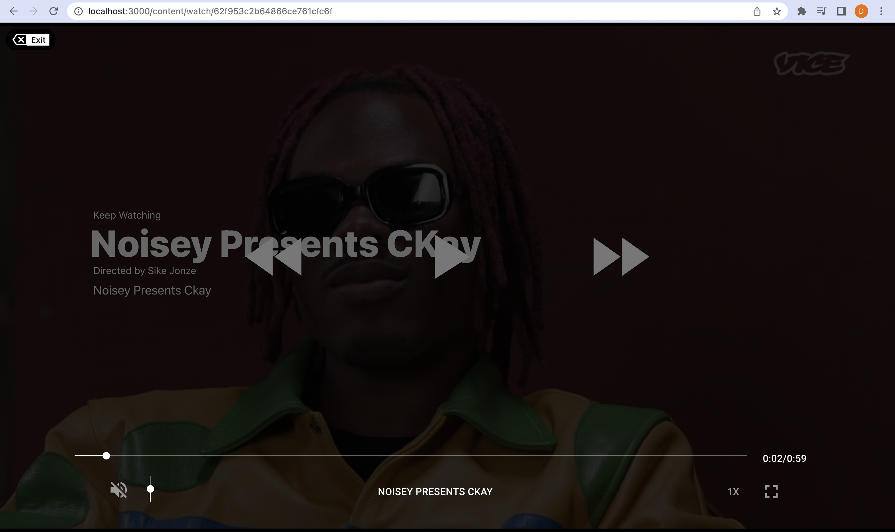
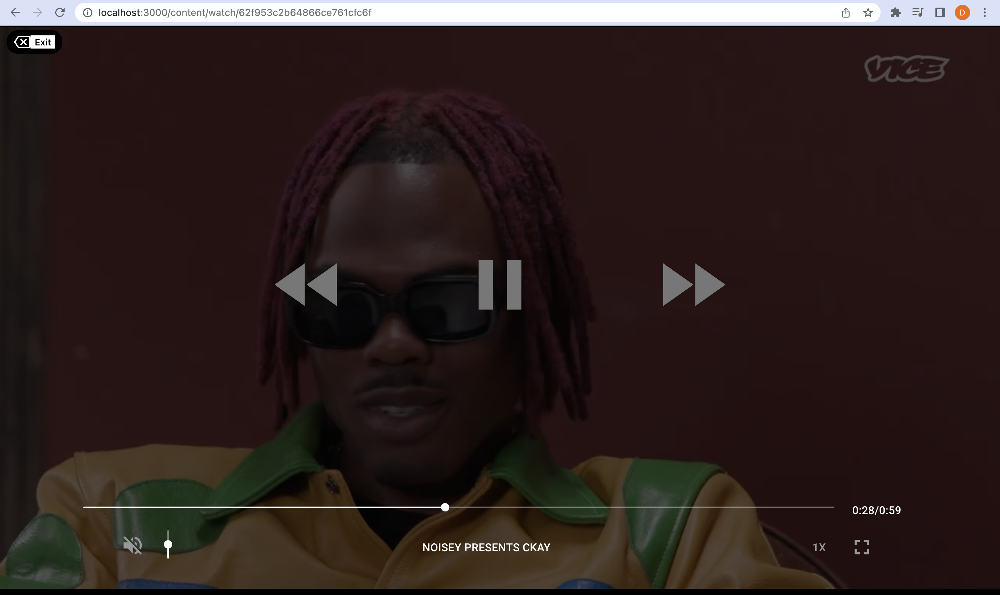
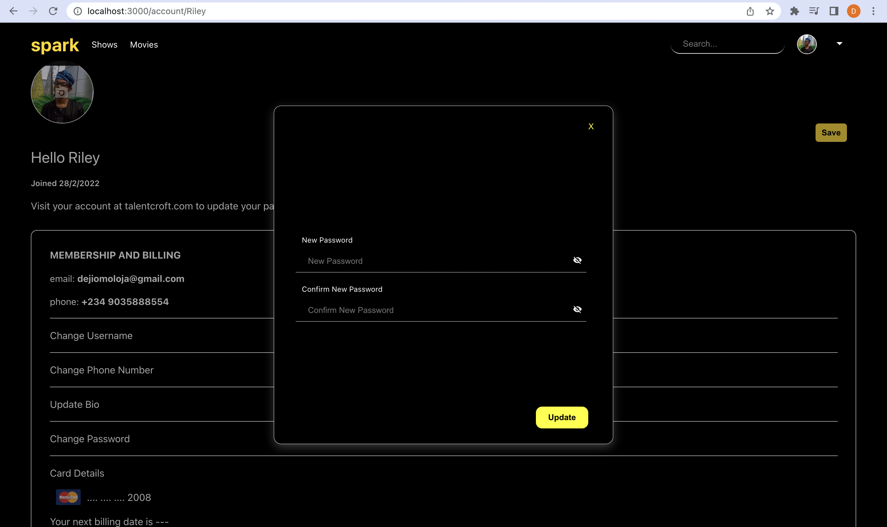
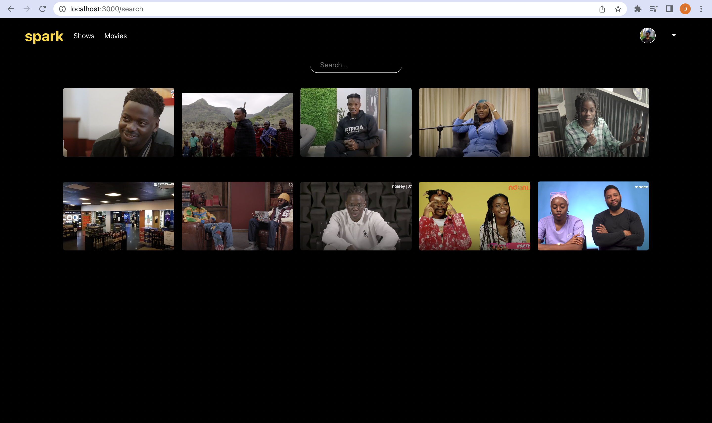

# Getting started with Spark By Talentroft

## Introduction
Spark is an online video platform where content creators and filmmakers can upload, display, and share their talents with others.
Our main goal is to create original content via a community of creators where collaboration is encouraged.

This Project is divided into three sub-projects.
-   Admin
-   Client
-   Server 

## Admin
The Admin sub-project is created for chosen Administrators with certain privileges to perform administrative tasks.

## Client
The Client sub-project is the platform where users can watch content.

## Server
The Server sub-project is where the content, user and administrator data are being stored and manipulated. 
[Spark-Server](https://github.com/Rileey/Spark-Server)

You are in the Client Repository.

This client project was bootstrapped with >> [Create React App](https://github.com/facebook/create-react-app).
You can learn more in the [Create React App documentation](https://facebook.github.io/create-react-app/docs/getting-started).

# Product Overview

## Objectives
This is the first version of the spark project.
The current version enables authenticated users on the platform to access to access spark's original movies and series content.
Once a user has been authenticated, the user can:
-   Sign Up
-   Log In
-   Browse Spark's Content
-   Watch Spark's Content 
-   Logout

# The source code.
The Spark Client was created using the React Library with the use of Context Api.
Learn more about react >> [React](https://reactjs.org).
Learn more about Context Api >> [Context](https://reactjs.org/docs/context.html).

# Components
## The Navbar
The navbar contains links to the following: 
### Features:
-   The Hompeage
-   The Shows Page (For TV Shows)
-   The Movies Page (For Movies/Films)
-   The Account Page
-   A searchbar
-   Logout Option

## Featured
The featured component is makes up the featured film/content that is to be displayed like a jumbotron on the homepage with certain information about the film.
## Lists
These lists are cards that make up the content on the homepage.
## ContentList
This is an array of the recommended films on the homepage.
### ContentListItem
This is an item in the content list that makes up the content list 
width: 140px;
height: 160px;

## List
This is an array of the recommended films on the homepage.
### ListItem
This is an item in the content list that makes up the content list
width: 185px;
height: 100px;

## Player Controls
The player controls make up the the control buttons/icons that can manipulate the video player.
We made use of "react-player" in order to manipulate the controls buttons.
The icons were downloaded from >> [Material UI](https://mui.com/).
Learn more about react-player package >> [react-player](https://www.npmjs.com/package/react-player).

## Password Modal
The Password modal is a modal that shows up when you try to change your password. It features two input fields:
New Password and Confirm New Password.

# Pages

## Register Page
This is where a user registers for access to original content from Spark.

## Log In Page
This is where a registed user can resume their access to Sparks platform.

## The Home, Shows and Movies Pages
These pages are where spark displays its available content to the authenticated user. It shows film, shows and content that has been made available by spark as long as the user is authenticated. 

The Pages Contain the following components that we discussed earlier.
-   The Nav Bar: The Navigation Bar is at the top of the application, it helps to navigate the web pages.
-   Featured: This is basically the large image on the homepage which begins to play video on hover.
-   Recommended Content List: A list of recommended content.
-   Other Content List: A list of other content to watch out for.

## Watch Page
This is where an authenticated user can watch the content.
If a user selects a film of their choosing they are directed to the watch page with that particular content's information.

## Account Page
The Account Page is where the user can find information about themselves.
Information such as Name, Date Joined, Card Details, etc.

## Search Page
This page shows a list of movies a user can filter through if they have a perticular movie in mind to search for. It can be activated when the searchbar is clicked.

## Content Page
This page shows the information of the content and its list of content.

## Available Scripts

In the project directory, you can run:

### `npm start`

Runs the app in the development mode.\
Open [http://localhost:3000](http://localhost:3000) to view it in your browser.

The page will reload when you make changes.\
You may also see any lint errors in the console.

### `npm test`

Launches the test runner in the interactive watch mode.\
See the section about [running tests](https://facebook.github.io/create-react-app/docs/running-tests) for more information.

### `npm run build`

Builds the app for production to the `build` folder.\
It correctly bundles React in production mode and optimizes the build for the best performance.

The build is minified and the filenames include the hashes.\
Your app is ready to be deployed!

See the section about [deployment](https://facebook.github.io/create-react-app/docs/deployment) for more information.

### `npm run eject`

**Note: this is a one-way operation. Once you `eject`, you can't go back!**

If you aren't satisfied with the build tool and configuration choices, you can `eject` at any time. This command will remove the single build dependency from your project.

Instead, it will copy all the configuration files and the transitive dependencies (webpack, Babel, ESLint, etc) right into your project so you have full control over them. All of the commands except `eject` will still work, but they will point to the copied scripts so you can tweak them. At this point you're on your own.

You don't have to ever use `eject`. The curated feature set is suitable for small and middle deployments, and you shouldn't feel obligated to use this feature. However we understand that this tool wouldn't be useful if you couldn't customize it when you are ready for it.

Hope you find this very helpful.

To learn React, check out the [React documentation](https://reactjs.org/).